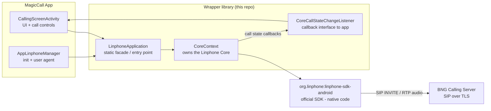
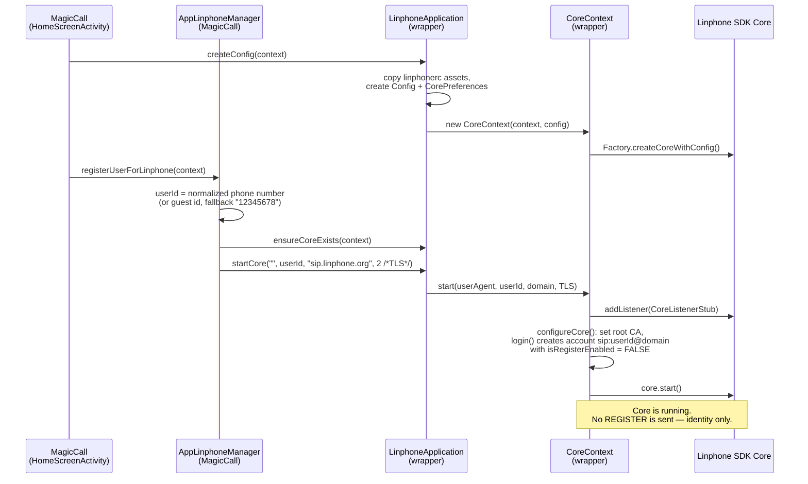
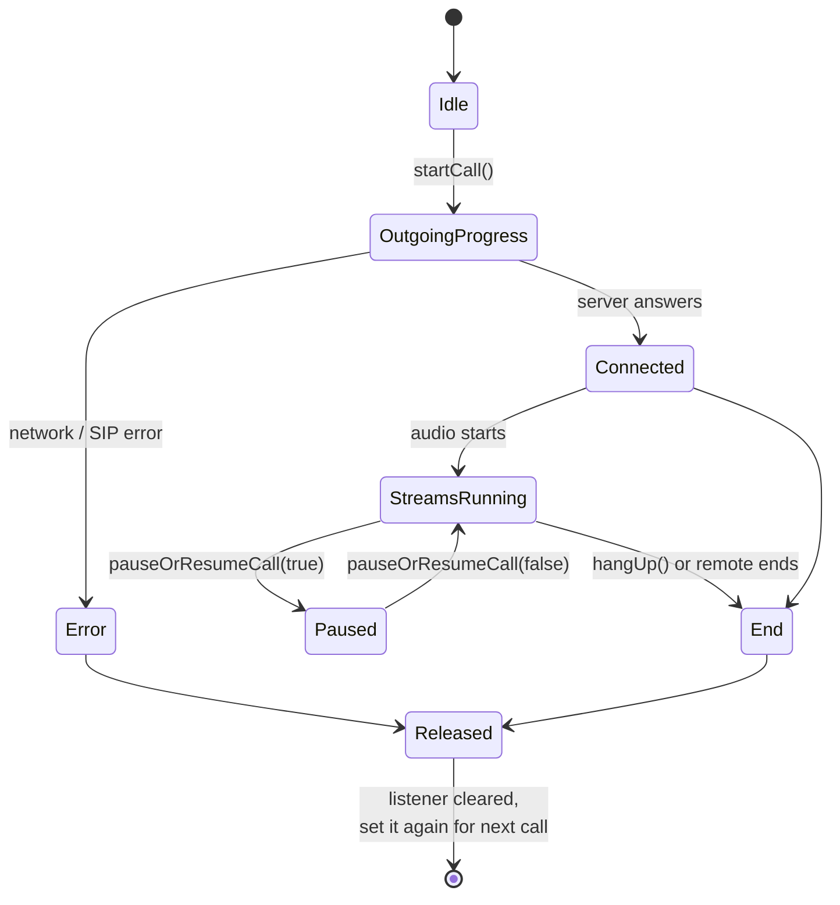
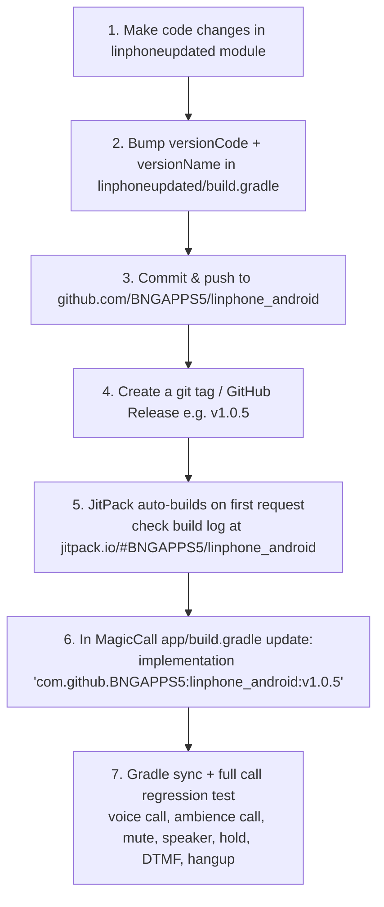

# Linphone Wrapper Library — Handover Document

**Library:** `linphoneupdated` (published as `com.github.BNGAPPS5:linphone_android`)
**Used by:** MagicCall Android app (audio-only VOIP calls)
**Repo:** https://github.com/BNGAPPS5/linphone_android
**Distribution:** JitPack (https://jitpack.io/#BNGAPPS5/linphone_android)

---

## 1. What is this library?

This is a **wrapper around the official Linphone SDK** (`org.linphone:linphone-sdk-android`), customized for MagicCall.

The original Linphone Android app code was stripped down and simplified so MagicCall only has to deal with a **small, simple API** instead of the full Linphone SDK. MagicCall never talks to the Linphone SDK directly — everything goes through this wrapper.

Key customizations for MagicCall:

- **Audio calls only** — all video, chat and conference UI from the original Linphone app is unused/removed.
- **Outgoing calls only** — MagicCall users dial out to the BNG calling server; there is no real "incoming call" feature.
- **No SIP registration** — `isRegisterEnabled = false`. We do not REGISTER with a SIP server; we send the INVITE straight to the BNG calling server IP/port.
- **PCMU (G.711) codec** support helper (see `printAvailableAudioCodecs()` in `CoreContext`).
- **Custom User-Agent header** — MagicCall packs a JSON (voice code, ambience file, email, IP, etc.) into the SIP User-Agent header. The BNG server reads this to know which voice-change/ambience effect to apply.
- **Simple callback interface** (`CoreCallStateChangeListener`) so app screens get call state changes without knowing anything about the Linphone SDK.

### Big picture



---

## 2. Project structure

Only one module matters: **`linphoneupdated`** (the `app` module in this repo is just a leftover shell — the library is what gets published).

```
linphoneupdated/src/main/java/com/bng/linphoneupdated/
├── LinphoneApplication.kt      ← ENTRY POINT. Static facade the app calls.
├── core/
│   ├── CoreContext.kt          ← THE HEART. Creates/configures/starts the Core,
│   │                              listens to call states, start/answer/end calls.
│   ├── CoreCallStateChangeListener.kt  ← Interface the app implements for call events.
│   ├── CorePreferences.kt      ← All settings, config file paths, feature toggles.
│   ├── CoreService.kt          ← Foreground service (keeps core alive in background).
│   ├── CorePushReceiver.kt / BootReceiver.kt  ← Push & boot hooks (mostly unused).
├── notifications/
│   └── NotificationsManager.kt ← Call/service notifications.
├── telecom/
│   └── TelecomHelper.kt etc.   ← Android Telecom framework integration (optional).
├── compatibility/              ← Per-Android-version helpers (API 23..33).
└── utils/
    ├── AudioRouteUtils.kt      ← Speaker / earpiece / bluetooth / headset routing.
    ├── LinphoneUtils.kt, PermissionHelper.kt, AppUtils.kt, ...
```

Important assets (`linphoneupdated/src/main/assets/`):

| File | Purpose |
|---|---|
| `linphonerc_factory` | Read-only base config for the Linphone Core (copied on first run) |
| `linphonerc_default` | Default user config (copied to app files dir as `.linphonerc`) |
| `rootcaa.pem` | Root CA certificate — loaded via `core.setRootCaData()` for TLS |

Library gradle facts (`linphoneupdated/build.gradle`):

- Depends on **`org.linphone:linphone-sdk-android:5.4.0`** (see Gotcha #1 — MagicCall substitutes this with 5.4.113).
- Current `versionName "1.0.4"`, `versionCode 5` → published as tag **`v1.0.4`**.
- minSdk 26, compile/target SDK 33.

---

## 3. The 4 classes you must understand

### 3.1 `LinphoneApplication` — the front door

Everything the app needs is a **static/companion function** here:

| Function | What it does |
|---|---|
| `createConfig(context)` | One-time setup. Copies config assets, creates the Linphone `Config`, creates `CorePreferences` and the `CoreContext`. Safe to call twice (it checks). |
| `ensureCoreExists(context, ...)` | Re-creates `CoreContext` if it was stopped. Call before making a call. |
| `startCore(userAgent, userId, domain, transportType)` | Starts the Core: adds listener, creates the SIP account (`sip:userId@domain`, **register disabled**), loads root CA, starts the engine. Transport: `0=UDP, 1=TCP, 2=TLS, 3=DTLS` — MagicCall always uses **2 (TLS)**. |
| `startCall(to, transportType)` | Dials a SIP address string. Parses it, forces the transport, then `coreContext.startCall(address)`. |
| `isSpeakerOn(bool)` | Routes audio to speaker, or back to earpiece/headset/bluetooth. |
| `isCallMicEnabled(bool)` | Mute / unmute the microphone. |
| `pauseOrResumeCall(pause)` | Hold / resume the current call. |
| `getCallState()` / `contextExists()` | State helpers. |

### 3.2 `CoreContext` — the heart

- Creates the actual `org.linphone.core.Core` from the config.
- Holds one big `CoreListenerStub` (`listener`) that receives **every call state change from the SDK** and translates it into our simple `CoreCallStateChangeListener` callbacks.
- Call actions: `startCall(address)`, `answerCall()`, `terminateCall()`, `hangUp()`, `sendDtmf(code)`, `setUserAgent(json)`, `setCallListener(listener)`.
- Extras handled inside: low-bandwidth mode, early media, audio routing to bluetooth/headset on connect, declining a VOIP call when a GSM call is already active, call error → user-friendly toast message.

### 3.3 `CoreCallStateChangeListener` — the callback into the app

`CallingScreenActivity` in MagicCall implements this and registers itself with `coreContext.setCallListener(this)`. Mapping from SDK state → callback:

| Linphone SDK `Call.State` | Wrapper callback fired | MagicCall uses it for |
|---|---|---|
| *every state change* | `callIdle(message, protocolCode)` | generic logging/handling |
| `OutgoingProgress` | `callOutgoingInit(message)` | show "Calling..." |
| `Connected` | `callConnected(message)` | start call timer, enable controls |
| `StreamsRunning` | `callStreamsRunning(message)` | audio is flowing |
| `Pausing` / `Paused` / `Resuming` | `callPausing` / `callPaused` / `callResuming` | hold/resume UI |
| `Error` | `callError(message, protocolCode)` | show error, close screen |
| `End` (declined by remote) | `callEnd(message, protocolCode)` | show "call ended" |
| `Released` | `callReleased(message, protocolCode)` | final cleanup |

> note: after `Error`, `End` or `Released` the wrapper sets `myCallStateChangeListener = null` — so the **app must call `setCallListener()` again before every new call** (MagicCall does this in `onCreate`/before dialing).

### 3.4 `CorePreferences` — settings

Wraps the `linphonerc` config file. Relevant flags: `sendEarlyMedia`, `routeAudioToBluetoothIfAvailable`, `autoAnswerEnabled`, `keepServiceAlive`, `useTelecomManager` (auto-disabled below Android 10), `preventInterfaceFromShowingUp`.

---

## 4. Flow diagrams

### 4.1 Initialization flow (app start / login)

MagicCall initializes the library from `HomeScreenActivity` (and re-registers from a few other places via `AppLinphoneManager.registerUserForLinphone()`):



### 4.2 Outgoing audio call flow (the main flow)

The dialed "number" is not a plain phone number — MagicCall builds a special SIP user part: **effect short-code + destination number**, pointed at the BNG calling server. The chosen voice/ambience is also sent in the **User-Agent JSON**.

```mermaid
sequenceDiagram
    participant UI as CallingScreenActivity<br/>(MagicCall)
    participant LA as LinphoneApplication
    participant CC as CoreContext
    participant SDK as Linphone SDK
    participant SRV as BNG Calling Server

    UI->>LA: ensureCoreExists()
    UI->>CC: setCallListener(this)  ← must be done before EVERY call
    UI->>CC: setUserAgent(json)  ← {"user":"ANDROID","ccode":..,"ambience":..,"pfname":..,"email":..,"ipaddress":..}
    UI->>UI: build address:<br/>voice call → sip:{HMPshort}{voiceCode}{number}@{serverIp}:{port}<br/>ambience → sip:{bgShort}{number}@{serverIp}:{port}
    UI->>LA: startCall(address, 2 /*TLS*/)
    LA->>SDK: interpretUrl(address), transport = TLS
    LA->>CC: startCall(address)
    CC->>CC: check network reachable,<br/>low-bandwidth mode, early media,<br/>set record file path
    CC->>SDK: inviteAddressWithParams()
    SDK->>SRV: SIP INVITE (TLS) + User-Agent JSON
    SRV-->>SDK: 100/180/200 OK, then RTP audio (PCMU)
    SDK-->>CC: onCallStateChanged(...)
    CC-->>UI: callOutgoingInit → callConnected → callStreamsRunning
    Note over UI: user talks; server applies<br/>voice change / ambience effect
    UI->>CC: hangUp()
    CC->>SDK: call.terminate()
    SDK-->>CC: End / Released
    CC-->>UI: callEnd / callReleased<br/>(listener is set to null here)
```

### 4.3 Call state machine (what the app sees)



### 4.4 In-call controls cheat-sheet

| User action | App calls | What happens inside |
|---|---|---|
| Mute mic | `isCallMicEnabled(false)` | `core.isMicEnabled = false` (re-enabled automatically after last call ends) |
| Speaker on/off | `isSpeakerOn(true/false)` | `AudioRouteUtils.routeAudioToSpeaker/Earpiece/Headset/Bluetooth` |
| Hold / resume | `pauseOrResumeCall(pause)` | `call.pause()` / `call.resume()` |
| Keypad digit | `coreContext.sendDtmf("5")` | `call.sendDtmfs()` — used to control effects mid-call |
| End call | `coreContext.hangUp()` | terminates current call |

---

## 5. Publishing a new version (JitPack) & updating MagicCall

The library is **not** on Maven Central — JitPack builds it straight from the GitHub repo tag. Full release flow:



Step-by-step:

1. **Change code** in the `linphoneupdated` module.
2. **Bump version** in `linphoneupdated/build.gradle`:
   ```gradle
   versionCode 6          // +1
   versionName "1.0.5"    // next version
   ```
3. **Commit and push** to `main` on `https://github.com/BNGAPPS5/linphone_android`.
4. **Create the tag/release** on GitHub matching the version, e.g. `v1.0.5`. The JitPack coordinate is exactly this tag.
5. **Trigger/verify the JitPack build**: open https://jitpack.io/#BNGAPPS5/linphone_android, click "Get it" on the new tag (or just Gradle-sync MagicCall — the first fetch triggers the build). A green log means success.
6. **Update MagicCall** — `app/build.gradle`:
   ```gradle
   implementation 'com.github.BNGAPPS5:linphone_android:v1.0.5'
   ```
7. **Repos needed by the consumer** (already present in MagicCall, needed for any new consumer):
   - `maven { url "https://jitpack.io" }` — to fetch the wrapper itself.
   - `maven { url "https://download.linphone.org/releases/maven_repository" }` (restricted to group `org.linphone`) — to fetch the underlying `linphone-sdk-android` transitive dependency.

---

## 6. Gotchas & things to remember

1. **SDK version substitution in MagicCall.** The wrapper declares `linphone-sdk-android:5.4.0`. MagicCall's `app/build.gradle` has a `resolutionStrategy` that force-substitutes it with **`5.4.113`** (its comment claims 5.4.0 "was never published" — that turned out to be wrong: 5.4.0 exists at `https://download.linphone.org/releases/maven_repository`; the original failure was the dead `https://linphone.org/maven_repository` repo URL). Keep the substitution deliberate: either align the wrapper on one exact version and drop the substitution, or update both together when upgrading the SDK. (SDK 5.4.x was adopted specifically for Android's **16 KB page size** requirement.)
    > The correct maven repo URL is `https://download.linphone.org/releases/maven_repository` — the old `https://linphone.org/maven_repository` now returns 404 and breaks Gradle sync (all `org.linphone.*` imports go red).
2. **No registration by design.** `isRegisterEnabled = false`. If calls fail, don't look for registration problems — check the INVITE target (server IP/port from shared prefs) and TLS/root CA instead.
3. **Set the call listener before every call.** The wrapper nulls `myCallStateChangeListener` after `Error`/`End`/`Released`. Forgetting `coreContext.setCallListener(...)` means the UI silently stops getting events for the next call.
4. **User-Agent is a data channel.** The BNG server reads the JSON in the SIP User-Agent header (voice code, ambience file name, record flag, etc.). If effects stop working, verify `createUserAgent()` output in `AppLinphoneManager` before blaming the server.
5. **Audio codec:** the server-side flow expects **PCMU (G.711)**. `CoreContext.printAvailableAudioCodecs()` can force-enable PCMU only (currently it is available but the enable-loop is what to check if codec negotiation fails).
6. **GSM call protection:** an incoming VOIP call is auto-declined with `Busy` if a native GSM call is active (`declineCallDueToGsmActiveCall()`).
7. **Telecom Manager is disabled below Android 10** (OS bug workaround) — handled automatically in `configureCore()`.
8. **`ensureCoreExists()` before dialing.** The core can be stopped (task removed, `terminateAllCalls()` etc.). MagicCall calls it in `checkCurrentCallAndMakeNew()` — keep that pattern.
9. **TLS everywhere.** Transport type is always `2` (TLS) and the root CA comes from `res/raw/rootcaa` / `assets/rootcaa.pem`. If the server certificate chain changes, this file must be updated and a new library version published.
10. **IPv6 is disabled** (`core.isIpv6Enabled = false` set in `startCall`) — was needed for the calling server; keep it unless the server confirms IPv6 support.

---

## 7. Quick reference — who calls what in MagicCall

| MagicCall file | Uses the wrapper for |
|---|---|
| `Linphone/AppLinphoneManager.kt` | `ensureCoreExists`, `startCore` (registration), building the User-Agent JSON |
| `activities/homeScreen/HomeScreenActivity.kt` | `createConfig` + `registerUserForLinphone` at startup |
| `activities/callingScreenActivity/CallingScreenActivity.kt` | The whole call: `setCallListener`, `setUserAgent`, `startCall`, `hangUp`, `sendDtmf`, `isSpeakerOn`, `isCallMicEnabled`, `pauseOrResumeCall`; implements `CoreCallStateChangeListener` |
| `manager/EchoCallManager.kt` | Echo/test call using the same core |
| `utils/CommonFunctions.kt`, `activities/contact/ContactsScreenActivity.kt` | Re-register user with Linphone after login/state changes |

---

*Document generated on 2026-07-06. Library version at time of writing: v1.0.4 (versionCode 5), Linphone SDK 5.4.0 → resolved as 5.4.113 in MagicCall.*
