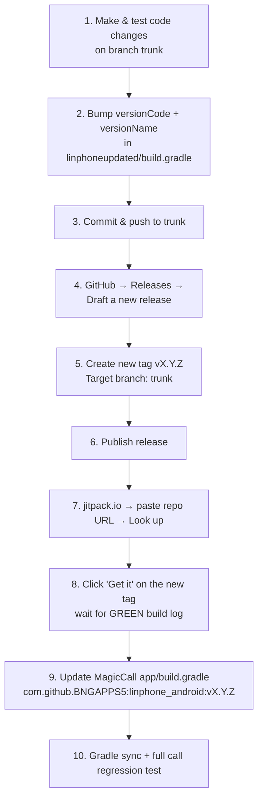

# Publishing a New Version of the Linphone Wrapper (GitHub Release → JitPack)

**Repo:** https://github.com/BNGAPPS5/linphone_android
**Working branch:** `trunk` ⚠️ (NOT `main` — `main` is stale and points to an old v1.0.1-era commit)
**JitPack page:** https://jitpack.io/#BNGAPPS5/linphone_android
**Latest published version at time of writing:** `v1.0.4`

---

## The whole flow at a glance



---

## Phase 1 — Prepare the code (in this project)

1. **Make sure you are on `trunk`:**
   ```bash
   cd "/Users/nisha/Desktop/Linphone BNG"
   git checkout trunk
   git pull origin trunk
   ```

2. **Make your code changes** in the `linphoneupdated` module.

3. **Bump the version** in `linphoneupdated/build.gradle` — increment both fields, and keep `versionName` identical to the tag you will create (minus the `v`):
   ```gradle
   defaultConfig {
       ...
       versionCode 6          // was 5 → +1 every release
       versionName "1.0.5"    // was "1.0.4" → will be tagged v1.0.5
   }
   ```

4. **Sanity-build locally** before pushing (this is roughly what JitPack will run):
   ```bash
   ./gradlew clean :linphoneupdated:assembleRelease
   ```
   If this fails locally, it will fail on JitPack too — fix it first.

5. **Commit and push to `trunk`:**
   ```bash
   git add .
   git commit -m "Release v1.0.5 - <short summary of changes>"
   git push origin trunk
   ```

---

## Phase 2 — Draft & publish the GitHub Release

1. Open the repo: https://github.com/BNGAPPS5/linphone_android

2. Right-hand sidebar → **Releases** → click **"Draft a new release"**
   (direct link: https://github.com/BNGAPPS5/linphone_android/releases/new)

3. **Choose a tag** → type the new tag, e.g. `v1.0.5` → click **"Create new tag: v1.0.5 on publish"**.

   > ⚠️ **Tag naming rules — important:**
   > - Always the format `vX.Y.Z` (or `vX.Y.Z.N` for hotfixes), matching `versionName`.
   > - Never reuse an existing tag. JitPack caches builds per tag — re-tagging the same name will NOT pick up new code.
   > - No spaces or brackets. (Old tags like `v1.0.1(2)` exist in the repo — do not repeat that pattern; such names break Gradle coordinates.)

4. **Target** dropdown → select **`trunk`**.
   > ⚠️ This is the #1 mistake to avoid. If GitHub defaults the target to `main`, your release will be built from **old code**. Always double-check it says `trunk`.

5. **Release title:** same as the tag, e.g. `v1.0.5`.

6. **Description:** short changelog so the team knows what changed, e.g.:
   ```
   - Updated linphone-sdk-android to 5.4.x (16KB page size support)
   - Fixed <bug>
   - versionCode 6 / versionName 1.0.5
   ```

7. Click **"Publish release"**.
   (You can click **"Save draft"** instead to prepare it early — but JitPack can only see the version once the release is **published**, because publishing is what creates the git tag.)

---

## Phase 3 — Build & fetch the version on JitPack

JitPack does not build automatically on release — it builds a tag **the first time someone requests it**. Trigger and verify it manually:

1. Go to **https://jitpack.io**

2. In the **"Git repo url"** box at the top, paste the repo URL:
   ```
   https://github.com/BNGAPPS5/linphone_android
   ```
   and click **"Look up"**.

3. JitPack shows the repo with tabs: **Releases / Builds / Branches / Commits**. Under **Releases** you should see your new tag (e.g. `v1.0.5`) at the top.

4. Click **"Get it"** next to the new version. This queues the build. The status icon meanings:
   - ⏳ spinner — building (usually 3–10 minutes for this library)
   - 🟢 green document icon — **build OK**, version is fetchable
   - 🔴 red document icon — **build failed**, click the icon to read the full build log

5. Once green, JitPack shows the dependency snippet:
   ```gradle
   dependencies {
       implementation 'com.github.BNGAPPS5:linphone_android:v1.0.5'
   }
   ```

   You can also verify from the terminal without opening a browser:
   ```bash
   # Build log / status for a specific version:
   curl https://jitpack.io/com/github/BNGAPPS5/linphone_android/v1.0.5/build.log
   ```

---

## Phase 4 — Update MagicCall to the new version

1. In the MagicCall project, open `app/build.gradle` and **search for `linphone_android`** — the line appears in **more than one place** (≈ lines 161, 207, 446; some active, some commented). Update **every active occurrence**:
   ```gradle
   implementation 'com.github.BNGAPPS5:linphone_android:v1.0.5'
   ```

2. Confirm the two required repositories are still present (they already are today — just don't remove them):
   - `maven { url "https://jitpack.io" }` — fetches the wrapper.
   - `maven { url "https://download.linphone.org/releases/maven_repository" }` — fetches the transitive `org.linphone:linphone-sdk-android`.

3. If you changed the **Linphone SDK version** inside the wrapper, also revisit the `resolutionStrategy` block in MagicCall's `app/build.gradle` (~line 89) that force-substitutes `linphone-sdk-android` with `5.4.113` — update or remove it to match.

4. **Gradle sync**, then run a full call regression test on a real device:
   - voice-change call, ambience call
   - mute/unmute, speaker on/off, hold/resume
   - DTMF during call, hang up from both sides
   - call after app kill/restart (core re-init path)

---

## Troubleshooting

| Problem | Cause / Fix |
|---|---|
| New version not visible on JitPack | The release was saved as **draft** (no tag exists yet) — publish it. Or refresh the JitPack page after "Look up". |
| Red build log on JitPack | Click the log icon. Most common causes: code doesn't compile (test `./gradlew :linphoneupdated:assembleRelease` locally), or a dependency repo unreachable. JitPack builds with the settings in this repo's `settings.gradle`, which already includes the linphone.org maven repo. |
| Build is green but Gradle in MagicCall can't resolve it | Check the version string matches the tag **exactly** including the `v` (`v1.0.5`, not `1.0.5`). Then try `./gradlew --refresh-dependencies`. |
| Pushed a fix but JitPack still serves old code | You reused an existing tag. JitPack caches per tag forever. Create a new tag (e.g. `v1.0.5.1`) and release again. |
| Release built from wrong/old code | Release target was `main` instead of **`trunk`**. Delete the release *and the tag*, re-draft with target `trunk`, and use a **new** tag name (cache!). |
| JitPack fails with "Unable to download toolchain ... vendor=JetBrains" | `gradle/gradle-daemon-jvm.properties` was committed. Android Studio generates this file and it pins a JetBrains JDK that JitPack cannot provision. **Never commit it** — delete it from the repo (`git rm`). This broke the original v1.0.5 build. |
| Fixed the code and force-moved the tag, but JitPack still shows the old error | JitPack caches per tag name and does NOT re-resolve a moved tag — it served the stale error instantly. Create a **new** tag name (e.g. `v1.0.5.1`) and delete the poisoned one from GitHub. |
| Need to test unreleased code in MagicCall | JitPack can build any commit or branch: `implementation 'com.github.BNGAPPS5:linphone_android:trunk-SNAPSHOT'` (latest trunk commit) or `:<commit-hash>`. Use only for testing — never ship a SNAPSHOT. |

---

## Version history convention

| Tag | versionCode | Notes |
|---|---|---|
| v1.0.5.1 | 6 | Current — SIP push disabled (FCM-token ANR fix), maven repo URL fix. (`v1.0.5` was burned by a failed JitPack build — see troubleshooting.) |
| v1.0.4 | 5 | Linphone SDK 5.4.x, 16KB page size support |
| v1.0.3.x | — | Older SDK 5.2.90 line |
| next → v1.0.6 | 7 | Follow this pattern |

Rule of thumb: 4th digit (`v1.0.4.1`) for a hotfix on an existing release, 3rd digit (`v1.0.5`) for normal changes, 2nd digit (`v1.1.0`) for big changes like a Linphone SDK major upgrade.
